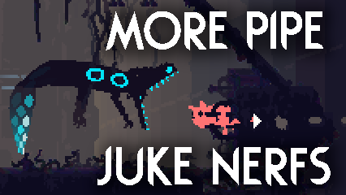

Rain World mod that nerfs pipe juking in many different ways

- Makes creatures aware of each other position and state when they meet in shortcut
- When creature sees other entering shortcut, it will know exactly that other will come out from other side
- Reduces amount of invincibility player gets after shortcut each time they go through same one
- Increases time before player can enter shortcut again after using same shortcut many times

All nerfs can be configured or disabled in remix menu
