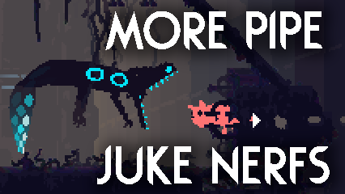

Rain World mod that nerfs pipe juking in many different ways without affecting normal gameplay much

- Makes creatures notice each other when they meet in shortcut
- When creature sees other entering shortcut, it will know exactly that other will come out from other side
- Gradually increases shortcut delay and reduces invincibility when player repeatedly uses same shortcut, so player can actually get killed

All nerfs can be configured or disabled in remix menu
